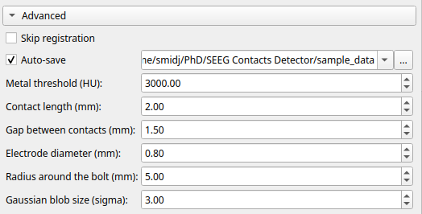

# Advanced Parameters

The module provides an **Advanced** settings panel for fine-tuning the detection process. By default, the electrode model parameters are configured for **DIXI Medical MICRODEEP® SEEG electrodes**. If you are using electrodes from a different manufacturer or with different specifications, you should adjust the Advanced parameters accordingly.

- **Skip registration**  
Skips the registration step after the **Create from T1** button is pressed and the brain mask is generated. This option can be used to save time during brain segmentation.  
*(Default: False)*

- **Auto-save**  
Automatically saves the following outputs:
    - Registration transform and brain mask after brain segmentation:  
        - `transform_T1_to_CT_autosave.h5`  
        - `CT_brain_mask_autosave.seg.nrrd`
    - Bolt fiducials after running the detection:  
        - `bolt_fiducials_autosave.fcsv`
    - Detected contact centers after running detection or after detection shifting:  
        - `contacts_autosave.fcsv`
        
    *(Default: True)*

- **Auto-save path**  
Directory where automatically generated files are saved.  
*(Default: Input CT folder; updates automatically when the input CT changes)*

- **Metal threshold**  
Intensity threshold (in HU) used to identify metal in the CT image.  
*(Default: 3000 HU)*

- **Contact length**  
Length of a single electrode contact in millimeters.  
*(Default: 2.0 mm)*

- **Gap between contacts**  
Distance between adjacent contacts on the electrode in millimeters.  
*(Default: 1.5 mm)*

- **Electrode diameter**  
Diameter of the electrode shaft in millimeters.  
*(Default: 0.8 mm)*

- **Radius around the bolt**  
Maximum distance (in millimeters) from the bolt fiducial used to detect bolt-related metal. Metallic structures beyond this radius are ignored for the selected bolt.  
*(Default: 5.0 mm)*

- **Gaussian blob size**  
Size of the contact region modeled as a Gaussian, expressed in sigma units.  
*(Default: 3.0 σ)*