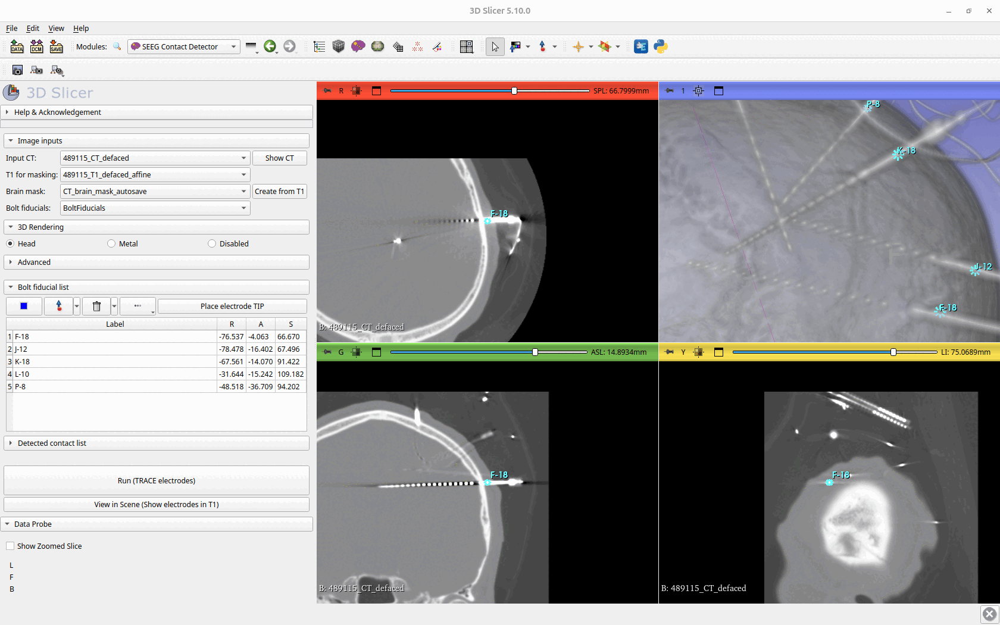

# SEEG Contact Detector - 3D Slicer Extension

The **SEEG Contact Detector** is a 3D Slicer extension that enables precise localization of SEEG electrode contact centers from post-implantation CT data.

The extension addresses the challenges of post-surgical electrode localization by combining model-based detection with advanced geometric fitting. Unlike manual annotation or simple linear models, the proposed approach respects the physical electrode model (fixed contact spacing and electrode length) and accounts for electrode bending and twisting using a 5th-degree polynomial fit. This makes the extension particularly suitable for clinical datasets where electrodes deviate from their planned trajectories due to surgical factors.

For automatic detection, the user must provide a post-implantation CT scan of the patient together with a corresponding brain mask. The tips of the anchor bolts must be either provided or manually selected, and the number of contacts for each electrode must be specified manually. Once these inputs are defined, the extension generates a point list of fiducials representing the estimated centers of contacts for each electrode.

---

## Motivation

Before implantation, a pre-surgical plan is created that precisely defines the intended trajectories of thin SEEG electrodes targeting suspected seizure-generating areas of the brain. During surgery, however, electrodes may deviate from the planned trajectories—for example due to misalignment of the stereotactic frame or because the electrodes are flexible and can be deflected by blood vessels.

After surgery, a post-implantation CT scan is acquired to verify the actual positions of the SEEG contacts. Unfortunately, these CT scans are often imperfect: electrodes may deviate from the intended path, and the electrode shaft itself can be twisted.

Manually inspecting all contacts and determining their centers in CT images is extremely demanding. Patients typically have many implanted electrodes, frequently each with more than ten contacts, which can result in over a hundred contacts per patient. Manual localization is further complicated by the fact that some contacts may be obscured by X-ray artifacts or shadows and are therefore poorly visible. As a result, manual detection is time-consuming and error-prone, since estimating the center of a contact from CT is difficult and experts may not strictly adhere to the electrode model (e.g., fixed inter-contact distances).

---

## Method Overview

The proposed algorithm estimates the initial linear direction of each electrode based on the orientation of its anchor bolt. This estimate is used to initialize a Gaussian Mixture Model (GMM), which segments the entire electrode from the CT image, including the anchor bolt.

Each segmented electrode is then fitted with a 5th-degree polynomial curve, allowing accurate modeling of electrode bending and twisting. An electrode model is subsequently generated and moved along the fitted curve. At each position, the correlation between the electrode model and the CT image is computed, and the position with the highest correlation is selected. The corresponding points are saved as the estimated centers of the electrode contacts.