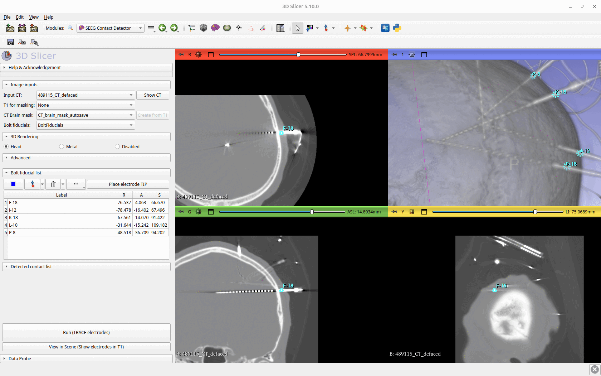

# SEEG Contact Detector - 3D Slicer Extension

**SEEG Contact Detector** is a 3D Slicer extension for automatic and accurate localization of stereoelectroencephalography (SEEG) electrode contacts from post-implantation CT imaging.

**Stereoelectroencephalography (SEEG)** is widely used in the presurgical evaluation of patients with drug-resistant focal epilepsy. Accurate localization of individual electrode contacts is essential for interpreting electrophysiological recordings, identifying seizure onset zones, and integrating SEEG data with anatomical imaging. However, manual localization of contacts in post-implantation CT scans is labor-intensive, time-consuming, and susceptible to inter-observer variability.

**SEEG Contact Detector** automates this process by combining image segmentation, electrode trajectory estimation, and model-based contact fitting. Unlike manual annotation or simple linear models, the proposed approach respects the physical electrode model: the algorithm accounts for electrode bending, twisting, and partial contact visibility while respecting the physical geometry of implanted electrodes, including contact spacing and electrode length. The result is a fast, reproducible, and highly accurate workflow for SEEG contact localization directly within 3D Slicer. This makes the extension particularly suitable for clinical datasets where electrodes deviate from their planned trajectories due to surgical factors.

To perform automatic detection, the user provides a post-implantation CT scan together with a brain mask or a pre-implantation MRI scan. Anchor bolts must either be provided or manually picked, and the number of contacts for each electrode must be specified. Once these inputs are defined, the extension then generates a fiducial list containing the estimated centers of all electrode contacts, which can be immediately reviewed and edited within the 3D Slicer environment.

---

## Motivation

SEEG implantation is planned preoperatively to target brain regions suspected of participating in seizure generation and propagation. Although implantation trajectories are carefully planned, the actual electrode positions may deviate from the intended trajectories because of surgical factors, such as stereotactic frame misalignment, tissue deformation caused by interactions with blood vessels or other anatomical structures, and the inherent flexibility of the electrodes themselves.

Post-implantation CT imaging is routinely acquired to verify electrode placement and determine the anatomical locations of individual contacts. This localization step is critical for subsequent clinical interpretation, yet it can be challenging in practice. A typical patient may have more than a dozen implanted electrodes and well over one hundred contacts. Furthermore, CT artifacts, contact overlap, curved electrode trajectories, and limited visibility of some contacts can make manual localization difficult and inconsistent.

SEEG Contact Detector was developed to reduce the time required for contact localization while improving reproducibility and adherence to the physical electrode model. The extension provides a fully integrated workflow for automatic detection, visual inspection, and rapid manual correction when necessary.

---

## Method Overview

The detection pipeline consists of four main stages:

1. **Anchor bolt segmentation** – metallic anchor bolts are segmented from the post-implantation CT using user-provided fiducial points.
2. **Trajectory initialization** – the linear orientation of each electrode is estimated from the segmented anchor bolt using principal component analysis (PCA), providing an initial estimate of the electrode entry point and trajectory.
3. **Electrode segmentation** – a Gaussian Mixture Model (GMM) assigns metallic voxels to individual electrodes, enabling robust separation of neighboring electrodes and electrode components.
4. **Model-based contact fitting** – each segmented electrode is represented by a 5th-degree polynomial curve that captures electrode bending and twisting. A physical electrode model is then fitted along the curve, and the position with the highest correlation to the CT image is selected. The resulting points correspond to the estimated centers of the electrode contacts.

This approach enables robust and precise localization even in challenging cases involving curved trajectories, closely spaced electrodes, or partially visible contacts.