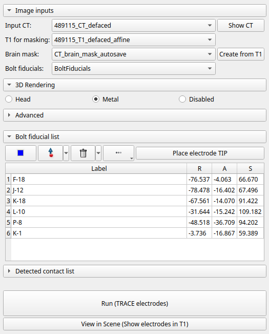
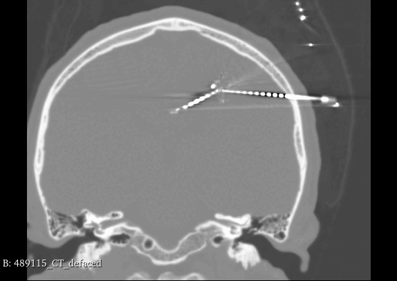
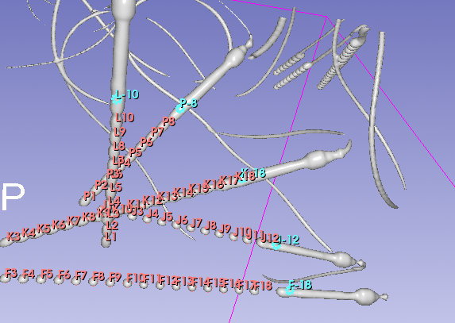
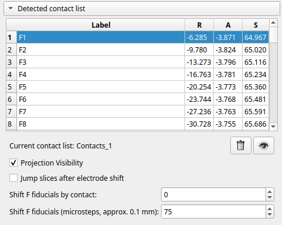
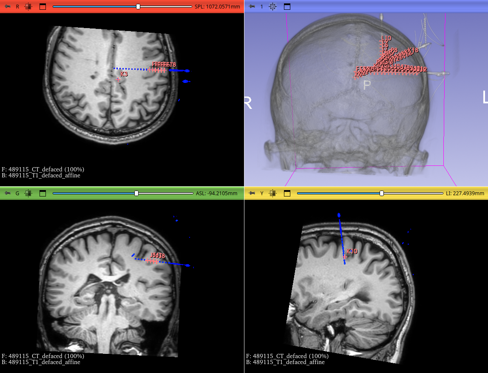

# Module Overview

The **SEEG Contact Detector** supports multiple input configurations depending on the data available. At a minimum, the module requires a **post-implantation CT volume** and a **brain mask segmentation** or a **T1-weighted MRI volume**. The following sections describe the workflow based on the available input modalities.

The module consists of an **Input** section, where the user can provide various combinations of data. To simplify setup, several inputs are selected automatically based on node names:

- A volume containing **`CT`** in its name is automatically selected as **Input CT**
- A volume containing **`T1`** in its name is automatically selected as **Input T1** (used for brain masking)
- A segmentation containing **`Mask`** in its name is automatically selected as **CT Brain mask**
- A Markups node containing **`Fiducials`** in its name is automatically selected as **Bolt fiducials**

When a post-implantation CT scan with SEEG electrodes is provided, the **Show CT** button can be used to refocus all 2D slice views on the selected CT volume.

---

## Brain Mask

The algorithm requires a brain mask segmentation in **CT space**. If a brain mask is loaded manually, it must already be registered to the CT.

If a brain mask is not available, a T1-weighted MRI volume can be provided to generate it automatically. After clicking **Create from T1**, the module:

1. Registers the T1 volume to the CT
2. Computes a brain mask using **HD-BET**
3. Creates the following new nodes:
    - **Transform T1 to CT**
    - **Transform CT to T1**
    - **CT Brain mask**

The **Transform T1 to CT** is immediately applied to the T1 volume, and the generated **CT Brain mask** is automatically selected as the active brain mask for the module.

---

## Bolt Fiducials

The final required input is **Bolt fiducials**, which represent the tips of the anchor bolts of the SEEG electrodes. A Markups node can be loaded from a file or created manually using this module.

To manually place bolt fiducials:

1. Use **Head** rendering (**F5**) to orient the patient’s head according to the implantation plan
2. Switch to **Metal** rendering (**F6**) to clearly visualize the anchor bolt
3. Place a fiducial on each anchor bolt, positioned near the tip of the bolt
4. Repeat this process for all electrodes

Each fiducial should lay on the metal of the anchor bolt and must be placed near the **tip of the anchor bolt** corresponding to an SEEG electrode.

Manually created fiducials inside **SEEG Contact Detector** are automatically named in alphabetical order using the format: `[label]-[number_of_contacts]`

For example:

- `A-12`
- `B-10`

### Naming Convention

You may rename electrodes, but the naming convention **must be preserved**. The electrode label may contain multiple letters, numbers, and dashes; however, the **final dash must be followed by the total number of contacts**. Specifically:

- `label` identifies the electrode and may include letters, numbers, and dashes
- `number_of_contacts` specifies the total number of contacts on that electrode and must appear after the last dash

---

## Running the Detection

Once all anchor bolts are correctly labeled, click **Run** to start the detection process.

After the process completes, a new Markup node named **Contacts** is created. This node contains the estimated centers of the contacts for each electrode, named using the format: `[label][contact_index]`, where `contact_index` denotes the contact position starting from the **tip of the electrode** toward the **entry point**.

The Detected contact list is automatically expanded, allowing you to view the coordinates of all contacts. Selecting a contact in the list automatically refocuses the slice views on its location. You can also use the **down arrow key** to navigate sequentially through the detected contacts. This makes it quick and easy to visually inspect all detections.

The Current contact list displays the name of the corresponding Markup node, which can also be found in the Data module. This Markups node contains all detected contact centers and can be saved, hidden, or deleted as needed.

When **Projection Visibility** is enabled, all detected contacts are displayed in the slice views, including those not located in the currently visible slice. When **Projection Visibility** is disabled, only contacts intersecting the current slice are shown.

If some detected contacts are misaligned, the module provides options to manually adjust the results. Please refer to the **[Troubleshooting](troubleshooting.md)** section for detailed instructions.

---

## View in Scene

The **View in Scene** button configures the scene for rapid visual inspection of detected contacts, primarily intended for radiologists and neurologists.

When activated:

- Slice views and 3D rendering are re-centered
- Head rendering is enabled
- If a T1 volume is available:
    - T1 is set as the background
    - CT is set as the foreground
- CT coloring is set to Ocean
- Thresholding is enabled so that only metallic structures are visible
- The brain mask and input bolt fiducials are hidden

If the brain mask was generated using **Create from T1** and a **Transform CT to T1** exists, this transform is applied so that the CT, brain mask, bolt fiducials, and detected contacts are all displayed in **T1 space**.

When **View in Scene** is deactivated:

- CT coloring is restored
- CT thresholding is disabled
- **Previously applied transformations remain unchanged**