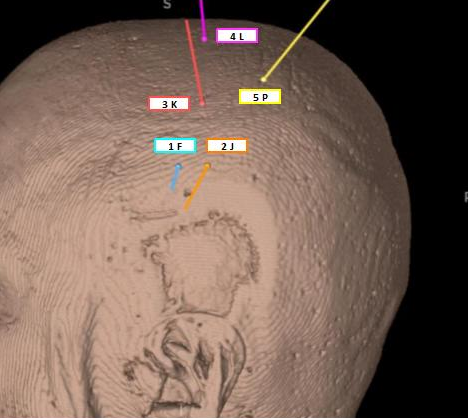

# Sample Data

We provide sample data used in this documentation and in the video tutorial, which can be downloaded directly from 3D Slicer.

Open the **Sample Data** module and locate the **SEEG Contact Detector** dataset. The dataset contains the following files:

- Post-implantation CT with 5 SEEG electrodes
- Preoperative T1-weighted MRI
- Bolt fiducials

To try the **SEEG Contact Detector** module, you need to download at least the **CT** and **T1** volumes, from which a brain mask can be generated. Bolt fiducials are also provided for a quick start; however, in practice, these fiducials must be placed manually. We recommend placing them using the **SEEG Contact Detector** module.

The provided T1 volume is intentionally rotated and shifted relative to the CT. Therefore, the CT and T1 must be aligned either by generating a brain mask using the **Create from T1** button or by performing manual registration. We strongly recommend using the **Create from T1** option, as the SEEG Contact Detector excludes metallic structures from the CT during registration, which significantly improves registration accuracy.

---

## Implantation Plan

Below is a screenshot of the implantation plan for the provided patient. Beneath the screenshot, a table summarizes the electrode labels and the corresponding number of contacts for each electrode.

|Order | Label | Color | No. contacts |
| - | - | - | - |
|1|F|Blue|18|
|2|J|Orange|12|
|3|K|Red|18|
|4|L|Pink|10|
|5|P|Yellow|8|

---

## Quick Start

1. Download the *CT with SEEG electrodes*, *Preoperative T1*, and *Bolt fiducials* from the **Sample Data** module. The data will be downloaded and displayed in the **Data** module.
2. Open the **SEEG Contact Detector** module.
3. Select the input **CT**, **T1**, and **Bolt fiducials**.
4. Click **Create from T1** to register the T1 to the CT and generate a brain mask.
5. Click **Run** to execute the algorithm.
6. An **Contacts** node will be created in the **Data** module, and the detected contacts will be displayed in the slice views and the 3D view.