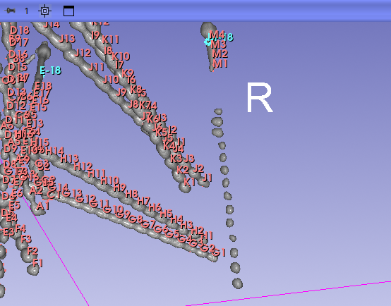
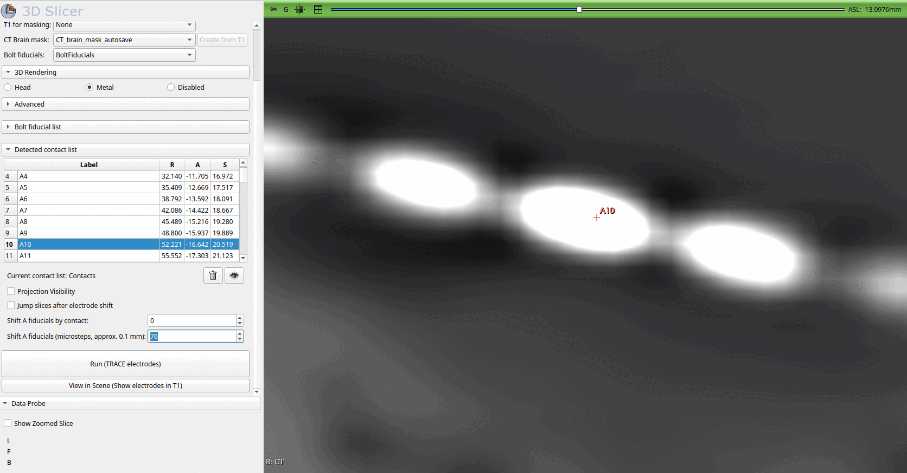
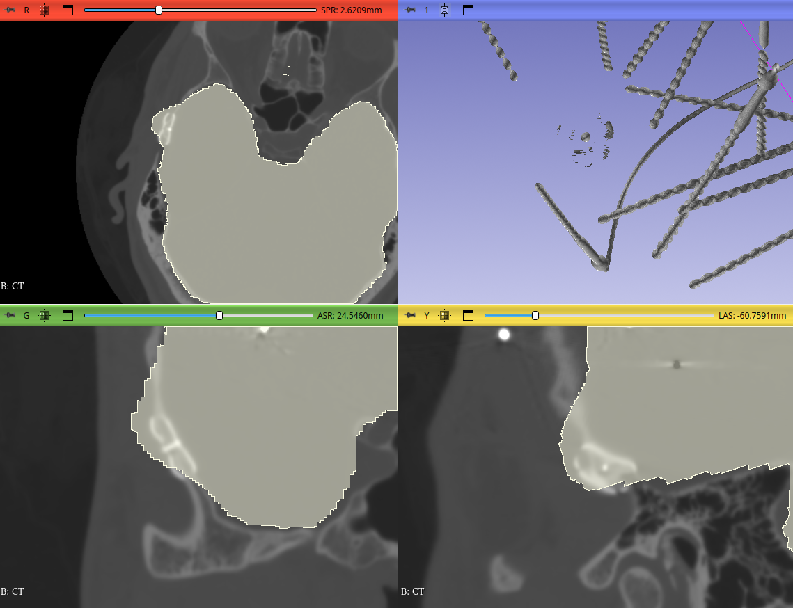
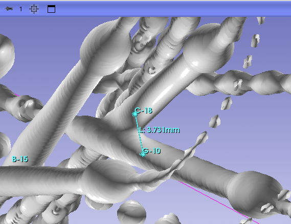

# Troubleshooting

If you are not satisfied with the results, or if the detection algorithm produces an error or warning, the following methods can help you correct or improve the detections.

---

## Manual Electrode Tip

When some contacts are not visible in the CT (e.g., contacts are shadowed or obscured by X-ray artifacts), the algorithm may fail to fit the electrode correctly. In such cases, it is not possible to find a configuration in which all modeled contacts align with metallic structures in the CT.

In this situation, you can manually define the electrode tip. First, remove the incorrect detection. Then open the **Bolt fiducial list**, select the electrode you want to correct, and click **Place electrode TIP**. This enables placement mode, allowing you to place a new fiducial at the tip of the first contact. The fiducial must be named `[label]-1`.

After placing the manual tip, rerun the detection. The manually defined tip will be used to initialize the algorithm.

The manually placed tip is also used for linear approximation of the electrode trajectory and for **Gaussian Mixture Model (GMM)** initialization.

---

## Shifting the Detection

### Shift by Whole Contact

In some cases, the algorithm may fail to segment the correct contact, typically when another electrode is located close to the tip of the electrode of interest. An example is shown below, where contacts **G1** and **I1** are incorrectly detected because parts of electrode **M** were assigned to electrodes **G** and **I**.

If the remaining contacts (e.g., G2, G3, etc.) are correctly detected and centered within the contacts, you can correct the detection by shifting the contacts along the electrode axis.

To fix electrode **G**, select any of its contacts in the **Detected contact list**, then use **Shift G fiducials by contact** below the table. You can shift the detections by up to two contacts in either direction. In this example, shifting by **+1 contact** produces the correct result. You can also enable **Jump slices after electrode shift**, which automatically recenters the slice views on the selected contact after the shift.

Similarly, electrode **I** can be corrected by shifting its detections by **+1 contact**.

> **Note:** In this particular case, the issue could also be resolved by manually placing the `G-1` and `I-1` fiducials, thereby defining the electrode tips as described in the previous section.

---

### Microsteps

If detected contact centers are slightly offset from the true center of the contact in the CT, you can refine their positions using **microsteps**.

Each microstep corresponds to approximately **0.1 mm**. One microstep represents a single point along the polynomial approximation of the electrode trajectory and is therefore the smallest possible adjustment.

The default microstep value corresponds to the polynomial point with the highest correlation between the electrode model and the CT image.

Increasing the value shifts the electrode outward (toward the bolt), while decreasing it shifts the electrode inward (toward the skull).

---

## Non-Electrode Metal in the CT

If the CT scan contains metallic objects such as skull clips, dental fillings, or other implants that are not SEEG electrodes or anchor bolts, special attention must be paid to the brain mask.

All non-SEEG metallic structures must be excluded from the brain mask. Any metal included in the brain mask may be incorrectly assigned to an electrode, causing the polynomial fit to be attracted to these false structures.

To correct this issue, switch to the **Segment Editor** module and edit the brain mask segmentation. Use the **Erase** tool to remove unwanted metallic structures. You may adjust the brush size or use the **Sphere brush** for convenience.

Precise editing is not required, but all SEEG electrode contacts must remain included in the brain mask.

---

## Bolt Fiducials Are Too Close to Each Other

When placing bolt fiducials, ensure that they are sufficiently spaced apart. The default value of the **Radius around the bolt** parameter is **5 mm**, and the largest metallic structure within this radius is used for linear approximation of the electrode trajectory.

If bolt fiducials are placed too close together, bolt segmentation may be incorrect, leading to poor initialization of the detection algorithm due to an inaccurate linear approximation.

To resolve this issue, adjust the fiducial positions so that they are farther apart.

