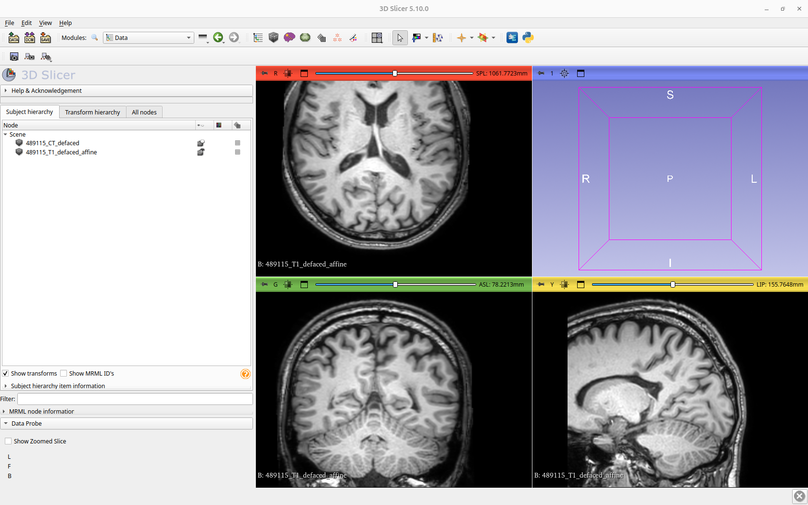
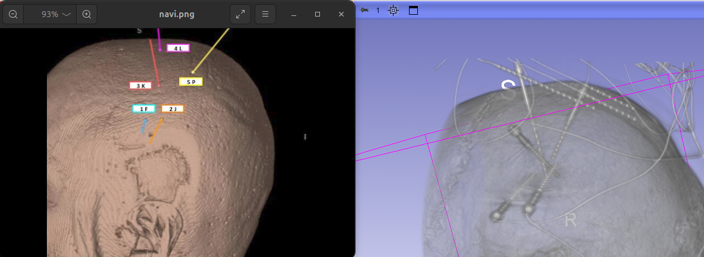
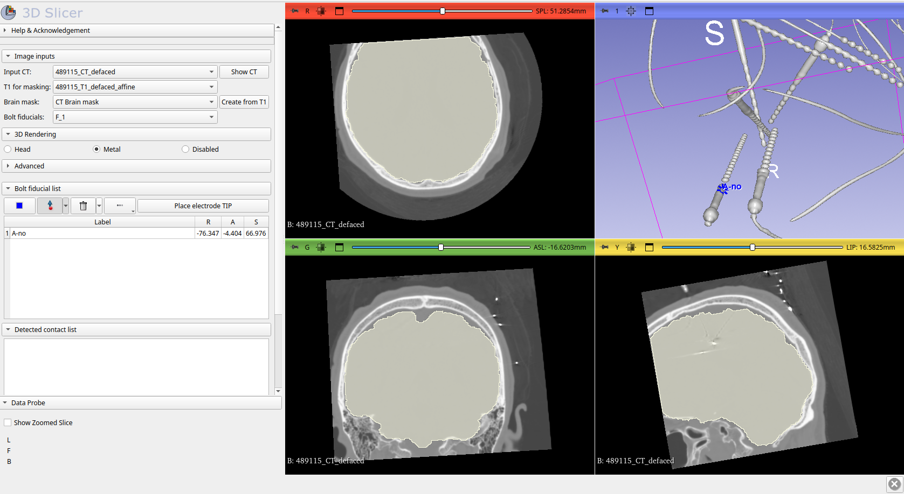
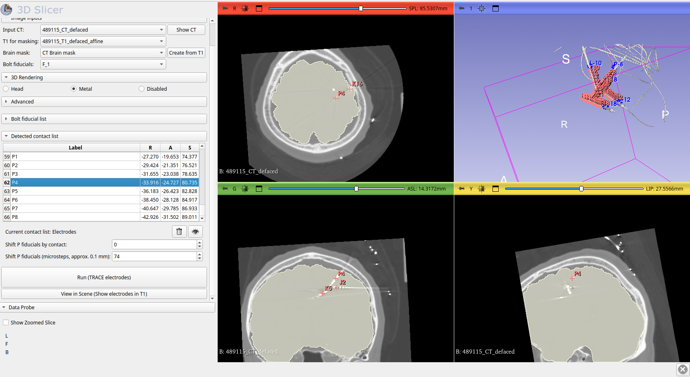
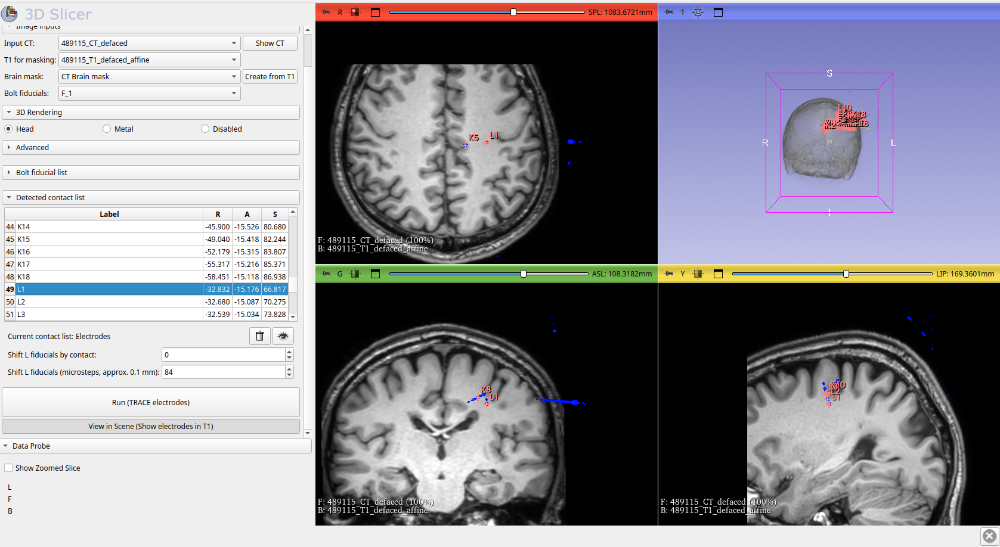

# Usage

Because multiple input configurations are possible, the following sections are organized according to the available input data and describe the corresponding step-by-step detection workflows.

---

## CT and Preoperative T1w

This is the most common scenario, in which a preoperative T1-weighted MRI and a post-implantation CT scan with SEEG electrodes are available. The workflow for this case is as follows:

1. Drag and drop the T1w and CT volumes into the 3D Slicer application to load them.  

2. Switch to the **SEEG Contact Detector** module and verify that the input volumes are selected correctly.

3. Click **Create from T1** to register the T1 volume to the CT and generate a brain mask. Once generated, the brain mask is automatically selected as the input brain mask. Inspect the mask to ensure it is accurate.

4. Create the bolt fiducials:
    - In the input section, select **Create new Point List**. This enables the controls in the **Bolt fiducial list**.
    - Press **F5** to enable *Head* rendering.
    - Rotate the 3D view to match the head orientation shown in the [implantation plan](sample_data.md/#implantation-plan). This helps identify electrode labels.

5. Place the fiducial for the first anchor bolt:
    - Press **F6** to switch to *Metal* rendering, which displays only metallic structures in the CT.
    - Reorient the 3D view to clearly visualize the anchor bolt tip.
    - Click **Place control point** and place a fiducial on the anchor bolt near its tip.
    - The fiducial and its RAS coordinates will appear in the **Bolt fiducial list** table.
    - Rename the fiducial and specify the number of contacts by double-clicking its label in the table. You should follow the [naming convention](module_overview.md#naming-convention).

6. Repeat this procedure for all remaining anchor bolts. You may switch between *Head* and *Metal* rendering as needed while placing fiducials.

7. Review all placed fiducials to ensure they are correct. You can navigate through them using the **down arrow key** or by clicking individual entries in the table.

8. Click **Run** to execute the detection algorithm.

9. An **Electrodes** node will be created in the **Data** module, and the detected contact centers will be displayed in the slice views and the 3D view. Verify that the detected contacts are correct.  
   You can navigate through the contacts in the **Detected contact list** using the **down arrow key** or by clicking individual entries in the table.

10. If you are satisfied with the results, click **View in Scene** to visualize the detected electrode centers overlaid on the T1w image.

---

## CT and Brain Mask

If a brain mask segmentation in CT space is already available, follow the same procedure as described above, but load the CT volume and the CT brain mask segmentation instead of a T1w volume. Select these as the input data in the **SEEG Contact Detector** module and skip the brain mask generation step.

Create anchor bolt fiducials as described above and run the detection to generate the **Electrodes** point list.

---

## Custom Bolt Fiducials

You can also use a custom Point List containing anchor bolt positions defined in CT space. In this case:

1. Load the CT volume (and optionally a T1w volume).
2. Generate a brain mask or load an existing CT brain mask segmentation.
3. Load the custom bolt fiducials and select them as the input **Bolt fiducials**.
4. Verify that the fiducial labels follow the required naming convention, including the correct number of contacts.
5. Run the detection algorithm and inspect the results.